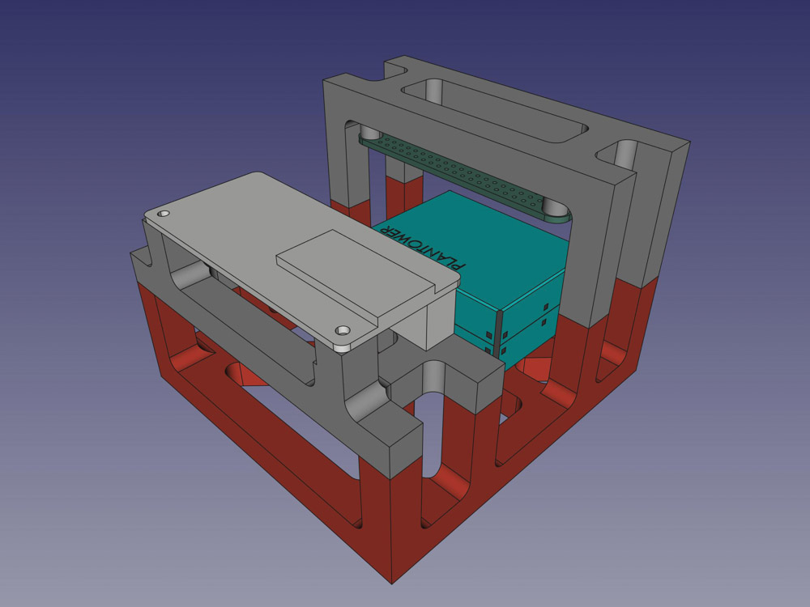
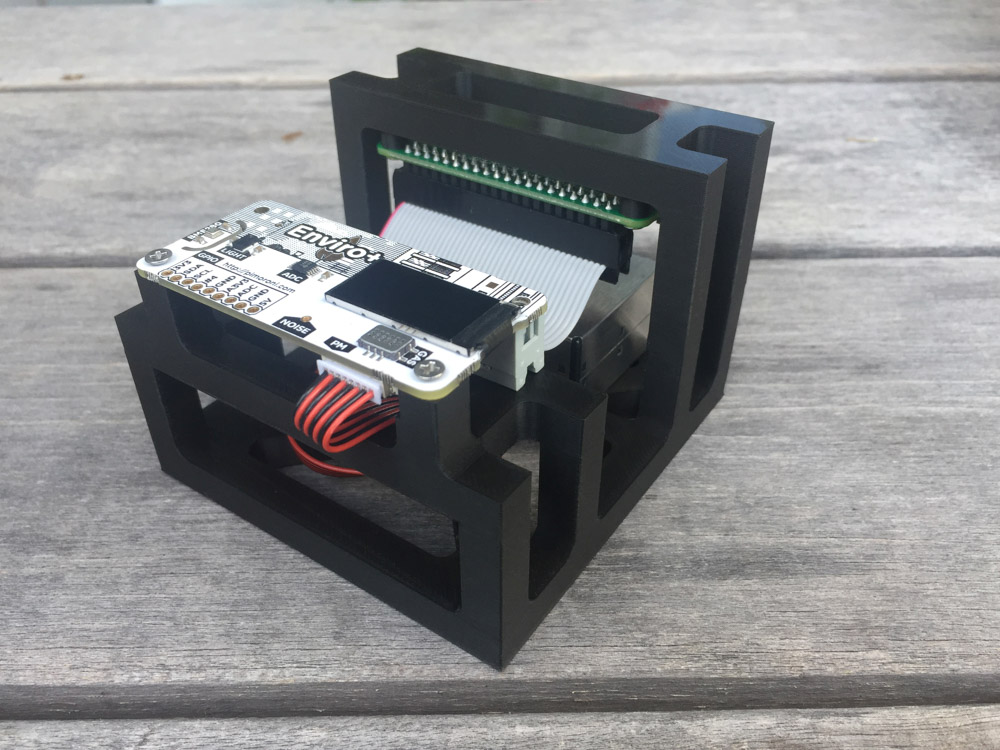
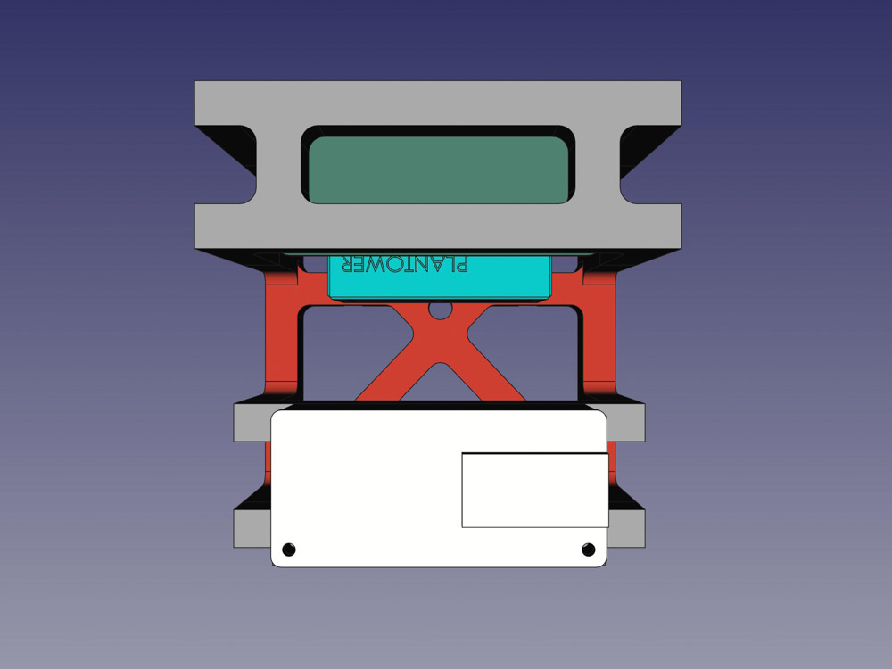
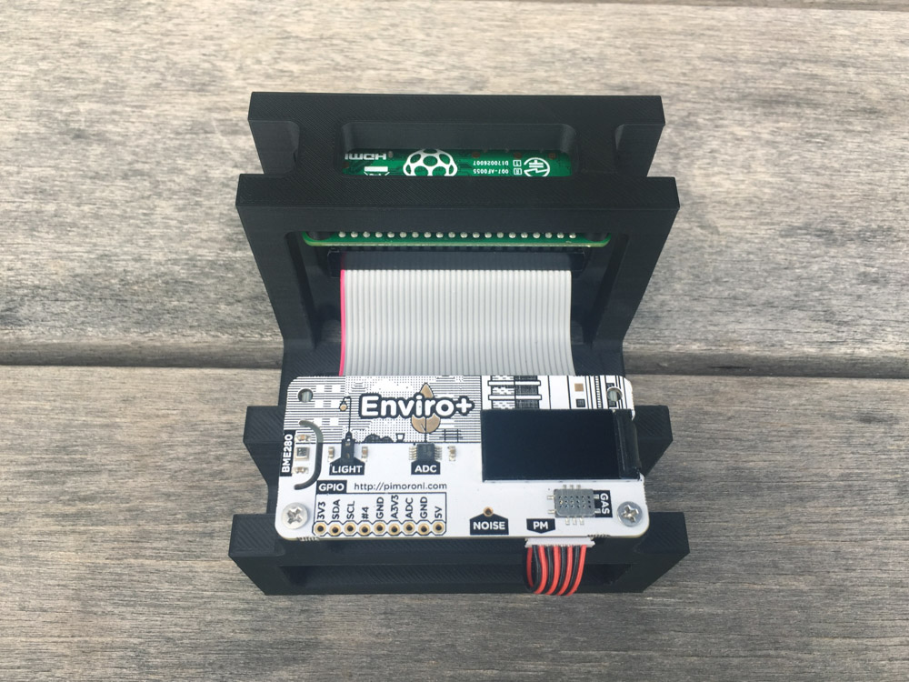
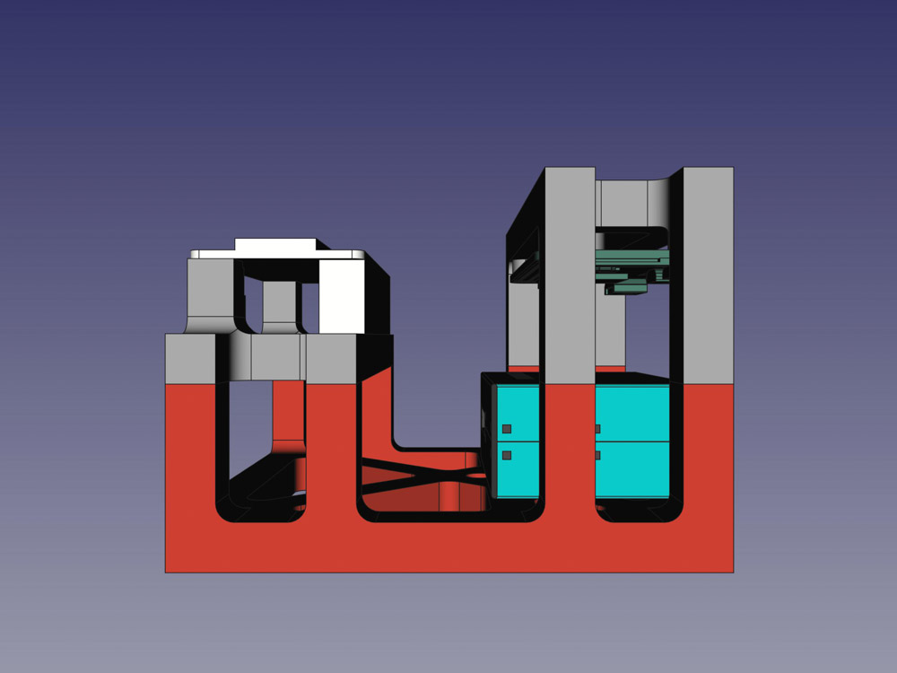
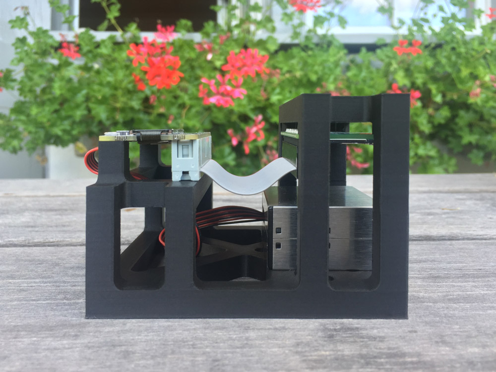
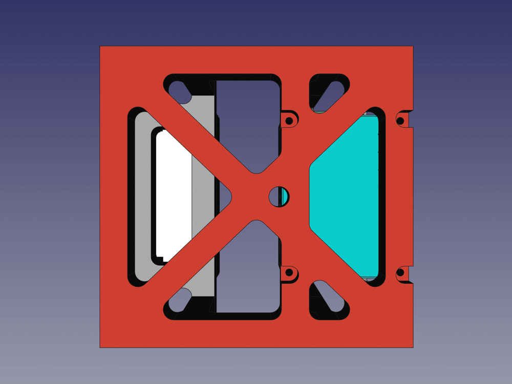
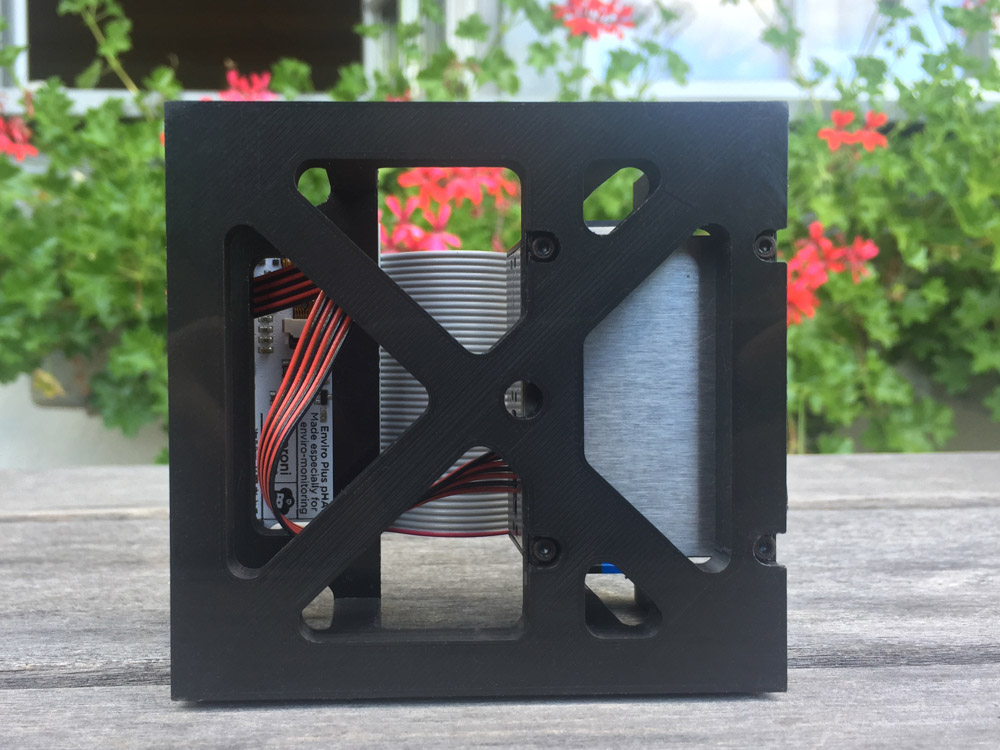

# Enviro+ and PMS5003 case

## About

*Designed for environmental monitoring, Enviro+ for Raspberry Pi lets you measure air quality (pollutant gases and particulates), temperature, pressure, humidity, light, and noise level. When combined with a particulate matter sensor, it's great for monitoring air quality just outside your house (more information below), or without the particulate sensor you can use it to monitor indoor conditions.*[1]

The sensors on the Enviro+ are very sensitive. The default design, where the sensor board is placed directly above the Raspberry Pi (Zero) is not great. The heat coming from the CPU of the RPi has a big influence on the BME280 temperature sensor. To overcome this, I designed a frame for mounting the Raspberry Pi Zero, the Enviro+ and the PMS5003, where the GPIO pins are connected with a ribbon cable.

| CAD | Photo |
| --- | --- |
|  |  |
|  |  |
|  |  |
|  |  |

## Print settings

| Setting             | Value     |
| ------------------- | --------- |
| Support             | No        |
|  Raft                 | No|
| Vertical resolution | 0.1mm     |
| Filament brand      | ColorFabb |
| Material | PLA/PHA |
| Infill | 20% |

## Assembly

1 x **Ribbon cable Male - Female**, to connect the Enviro+ to the Raspberry Pi Zero.

4 x **M2 4mm,** to attach the PMS5003 to the frame.

8 x **M2.5 4mm**, to attach the Raspberry Pi and Enviro+ board to the frame.

## References

- ["Getting started with Enviro+"](https://learn.pimoroni.com/tutorial/sandyj/getting-started-with-enviro-plus)

- [Review of Pimoroni's Enviro+ board - Part1: gas, temp., humidity, pressure and particulate matter](https://www.youtube.com/watch?v=L1kl1kVbmBw)
- [Review of Pimoroni's Enviro+ board - Part2: LCD, noise level, light+proximity](https://www.youtube.com/watch?v=d4MCVbEHTlE)